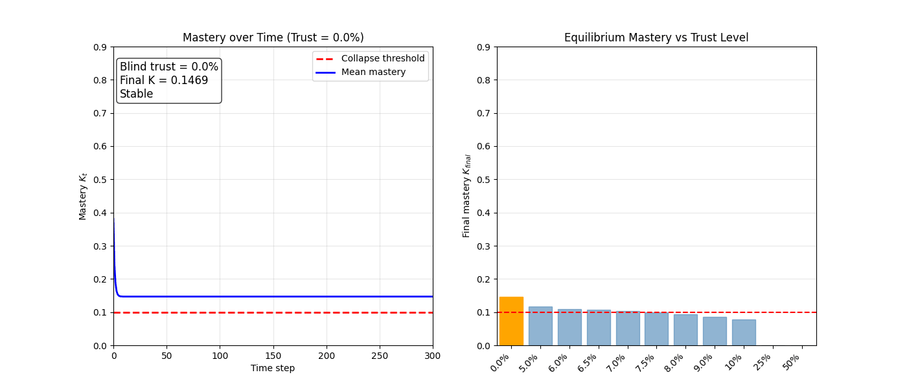
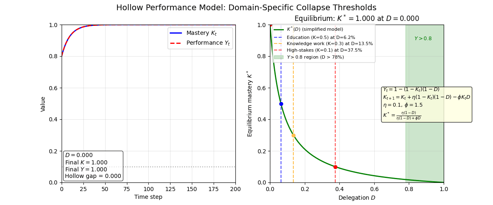

# Hollow Performance: A Closed-Loop Learning Theory of Human–AI Dependence

[](https://opensource.org/licenses/MIT)
[](https://www.python.org/downloads/)

**Authors**: Ramesh Neupane  
**Repository**: [https://github.com/timewise2528-hub/simulation-Hollow-Performan]  
**ORCID**:  0000-0001-5275-8735

This repository contains the complete mathematical models, synthetic simulations, and visualisation code for the paper:

> *Hollow Performance: A Closed-Loop Learning Theory of Human–AI Dependence*  
> *Mathematical Models, Synthetic Simulations, and Implications for Education, Health, Knowledge Work, and Society*
>

## Abstract

Large language models (LLMs) can raise visible task performance while weakening durable human mastery – a phenomenon we call **hollow performance**. This paper formalises two linked models:

## Collapse Transition Around 7.5% Blind Trust

The animation below shows stochastic simulations for increasing blind trust levels (0% to 50%).  
The red dashed line marks the collapse threshold (K = 0.1). At **7.5%** trust, mastery drops below the line – the system enters a hollow performance equilibrium.



*Figure: Time evolution of mean mastery (left) and final equilibrium mastery (right) for each trust level. The highlighted orange bar in the right panel shows the current trust level. The transition from stable (K > 0.1) to collapsed (K < 0.1) occurs sharply around 7.5%.*

1. **Simple risk model** of unverified delegation:  
   $r = D(1-V)$, with safety boundary $D(1-V) < \frac{1}{1+\kappa}$.

2. **First‑principles dynamic model** separating observed performance $Y_t$ from human mastery $K_t$:  
   $Y_t = 1-(1-K_t)(1-A_t)$,  
   and durable learning  
   $L_t = \eta(1-K_t)Q_t\,G(P_t,F_t,J_t,B_t)\exp\!\left(-\frac{\lambda\tau}{1+\rho S_t}\right)$.

Synthetic simulations show that blind AI substitution can keep $Y_t \approx 0.97$ while $K_t \to 0$. The code reproduces all simulations and figures from the paper.

> ## Mathematical Model-2 of Hollow Performance[simple version]

The animation below implements the simplified model described in the paper. It shows:

- **Left panel**: Time evolution of mastery \(K_t\) (blue) and observed performance \(Y_t\) (red) as delegation \(D\) increases from 0 to 1.
- **Right panel**: Equilibrium mastery \(K^*(D)\) with a moving marker for the current \(D\).
- **Equations**: The three core equations of the model.

At \(D \approx 0.075\) (7.5% delegation), mastery collapses below 0.1 while performance stays near 0.9 – the hollow performance regime.



*Figure: Animation showing the transition from safe to hollow performance as AI delegation increases. The red dashed line marks the collapse threshold (K=0.1).*
## Domain‑Specific Collapse Thresholds (Simplified Model)

The simplified model gives the equilibrium mastery \(K^* = \frac{\eta(1-D)}{\eta(1-D)+\phi D}\) with \(\eta=0.1\), \(\phi=1.5\).  
Using this, we derive the delegation \(D\) at which mastery falls below critical levels for different domains:

| Domain | Mastery threshold \(K^* <\) | Delegation \(D\) (blind trust) | Observed performance \(Y\) at that \(D\) | Hollow performance? |
|--------|------------------------------|--------------------------------|------------------------------------------|---------------------|
| **Education** | 0.5 (unaided exam competence) | **6.25%** | 0.53 | No (Y < 0.8) |
| **Knowledge work** | 0.3 (audit & error detection) | **13.5%** | 0.39 | No |
| **High‑stakes (health, law)** | 0.1 (safety margin) | **37.5%** | 0.44 | No |

> **Note:** In this simplified model, **true hollow performance** (observed performance \(Y > 0.8\) while mastery \(K < 0.1\)) requires delegation \(D > 78\%\). The paper’s full model, however, shows collapse already at \(D \approx 7.5\%\) for high‑stakes domains due to additional mechanisms (separate forgetting, degraded learning‑loop, offloading loss). Thus the simplified model is a pedagogical tool; policy recommendations should rely on the full model.

See the animation `hollow_model_animation_domain_thresholds.gif` for a visual sweep of these thresholds.
## Mathematical Models & Code Mapping

All equations are implemented in [`src/hollow_performance.py`](src/hollow_performance.py). The table below maps each mathematical component to the corresponding method.

| Mathematical symbol | Description | Code method |
|---------------------|-------------|--------------|
| $Y_t = 1-(1-K_t)(1-A_t)$ | Observed performance | `observed_performance(K, A)` |
| $L_t = \eta(1-K_t)Q_t G \exp\!\left(-\frac{\lambda\tau}{1+\rho S_t}\right)$ | Durable learning | `durable_learning(K, Q, G, retention)` |
| $G(P,F,J,B) = \alpha P F J B + \beta$ | Learning‑loop strength | `learning_loop_strength(P, F, J, B)` |
| $Q_t = M_t \cdot \text{difficulty}_t \cdot \text{load}_t$ | Context quality | `context_quality(M, diff, load)` |
| $\exp\!\left(-\frac{\lambda\tau}{1+\rho S_t}\right)$ | Retention factor | `retention_factor(S)` |
| $\delta_{\text{off}} = \phi A_t (1-P_t)(1-B_t)$ | Passive offloading loss | `offload_loss(A, P, B)` |
| $\delta_{\text{forget}} = \delta_{\text{forget}} \cdot K_t$ | Forgetting | `forget_loss(K)` |
| $K_{t+1} = K_t + L_t - \delta_{\text{off}} - \delta_{\text{forget}}$ | Mastery update | `mastery_update(K, L, off, forget)` |
| $D(1-V) < \frac{1}{1+\kappa}$ | Safe risk boundary | `risk_boundary(kappa)` (static) |

### Simple Risk Model

- **Delegation** $D \in [0,1]$: degree of AI reliance  
- **Verification** $V \in [0,1]$: human verification / ownership  
- **Unverified delegation**: $r = D(1-V)$  
- **Risk weight** $\kappa \ge 0$ (domain‑specific)  
- **Safe region**: $D(1-V) < \frac{1}{1+\kappa}$

### First‑Principles Dynamic Model

- **Human mastery** $K_t \in [0,1]$: unaided capability  
- **AI assistance** $A_t \in [0,1]$  
- **Observed performance**: $Y_t = 1 - (1-K_t)(1-A_t)$  
- **Durable learning** $L_t$ (after delay $\tau$) uses four key learning‑loop components:  
  - $P_t$: prediction ownership  
  - $F_t$: feedback visibility  
  - $J_t$: judgment correction  
  - $B_t$: rebuild practice  
- **Context quality** $Q_t = M_t \cdot D_t \cdot C^{\text{load}}_t$  
- **Spaced practice** $S_t$ slows forgetting: $\exp(-\lambda\tau/(1+\rho S_t))$  
- **Passive offloading** loss: $\phi A_t (1-P_t)(1-B_t)$

## Repository Structure
hollow-performance/
├── README.md                    # This file
├── requirements.txt             # Python dependencies
├── src/
│   └── hollow_performance.py    # Core model class
├── simulations/
│   ├── run_all.py               # Reproduce all four simulations + figures
│   ├── dynamic_run.py           # Interactive parameter sweeps
│   └── data/                    # Generated synthetic datasets (CSV)
├── notebooks/
│   └── explore.ipynb            # Jupyter notebook for step‑by‑step exploration
├── figures/                     # Pre‑generated figures (PNG, GIF)
│   ├── sim1_deterministic.png
│   ├── sim2_fixed_trust.png
│   ├── sim3_random_trust.png
│   ├── sim4_stochastic.png
│   └── animation_*.gif
└── tests/
    └── test_model.py            # Unit tests for equations

## Getting Started

### 1. Clone the repository

```bash
git clone **https://github.com/USERNAME/hollow-performance-llm-dependence.git**
cd hollow-performance-llm-dependence
